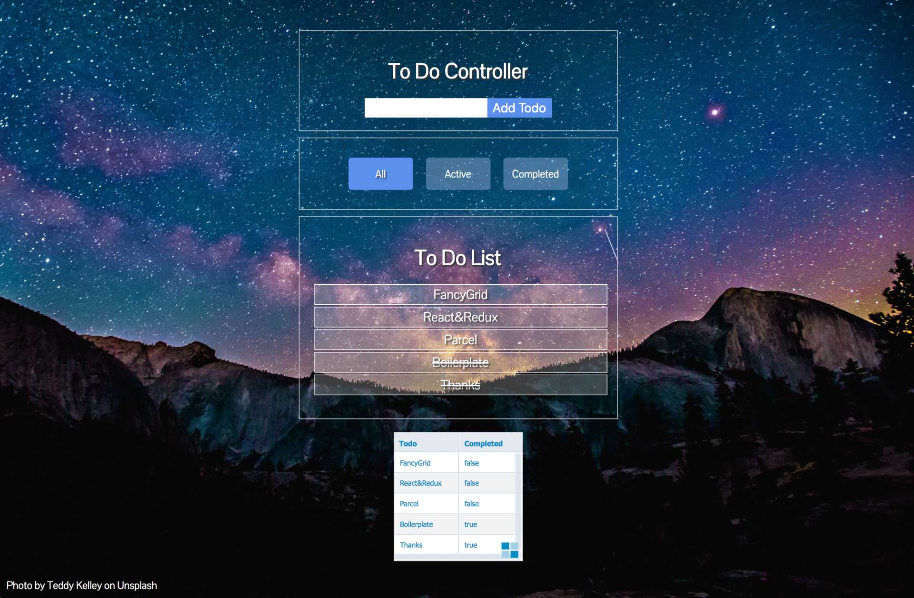

# Parcel + Redux Boilerplate
[Sample Site](https://parcel-redux.netlify.com/)
# 💬 Feature
This Boilerplate using Parcel module bundler.
And made the Redux Todo list based on Redux docs example.

# 🔧 Insatllation
```zsh
git clone https://github.com/sonim1/parcel-redux-boilerplate.git myproject

cd myproject

yarn
```
## Start App
```zsh
yarn start
yarn dev
yarn build
```

# Sample Image

[Sample Site](https://parcel-redux.netlify.com/)

# References
- [Parcel](https://parceljs.org/)
- [React](https://reactjs.org/)
- [Redux](https://redux.js.org)
- [FancyGrid](https://fancygrid.com/)
- [Sass](https://sass-lang.com/)
